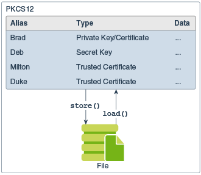

# PKI (Public Key Infrastructure)

https://docs.oracle.com/javase/8/docs/technotes/guides/security/crypto/CryptoSpec.html#Key

pki 提供了基于 public key 的一套信息安全交换框架。

它允许 identity, principal 绑定到 数字证书，并且提供一种验证证书真实性的方式。

它包括了 keys （public key, private key, secret key）， 证书，公钥加密，可信的 Certification Authorities （证书机构）。

## Certificate(证书)

证书里包含的是 public key, 多个证书形成一个 证书链。

## KeyStore (key仓库)
用于存储 key, certificate

- 可以存储的key形式有：
    - secretKey 
    - privateKey-certificates 存储的是 private key和关联的certificate链
- 也可以支持存储 certificate链

JAVA 中的私钥通常采用PKCS#8格式编码，公钥通常采用X509格式编码
